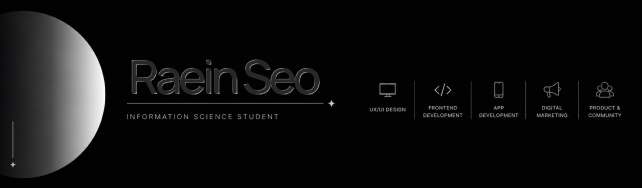

## 👩🏻‍💻 Introducing Myself

Hello, I'm Raein. I'm an Information Science student at the University of Wisconsin-Madison, interested in UX/UI design, frontend development, app development, and digital marketing.

- Designing user-centered interfaces with Figma.
- Building web projects using HTML, CSS, JavaScript, and React.
- Developing app ideas with SwiftUI and Xcode.
- Creating branding and marketing ideas for digital products.

### 📚 Projects

Welcome to my portfolio, where I showcase my [projects](YOUR_PORTFOLIO_LINK_HERE).

### 🛠 Skills & Tools

- **Design:** Figma, Canva
- **Frontend:** HTML, CSS, JavaScript, React
- **App Development:** SwiftUI, Xcode
- **Marketing:** Branding, social media content, Google Analytics
- **Product:** UX research, wireframing, prototyping, product thinking
  
### 👋🏻 Connect with Me

- [Portfolio](YOUR_PORTFOLIO_LINK_HERE)
- [LinkedIn](https://www.linkedin.com/in/raein-seo/)
