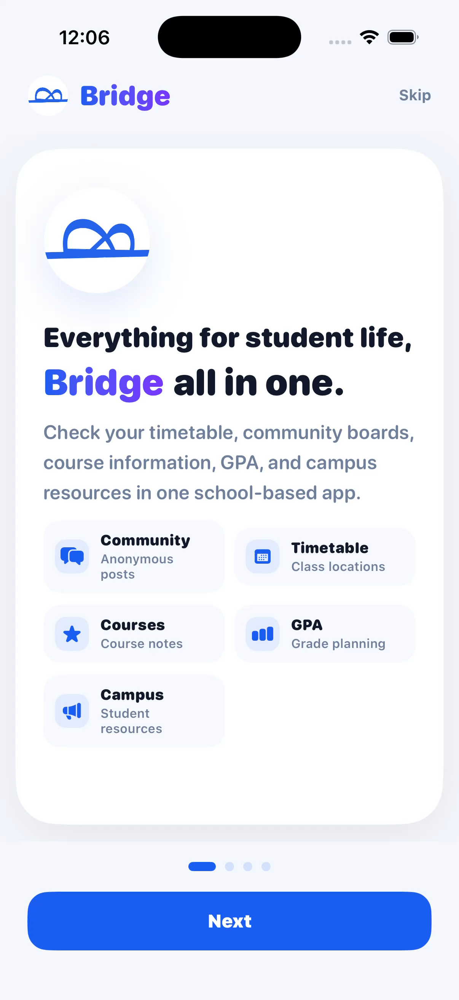
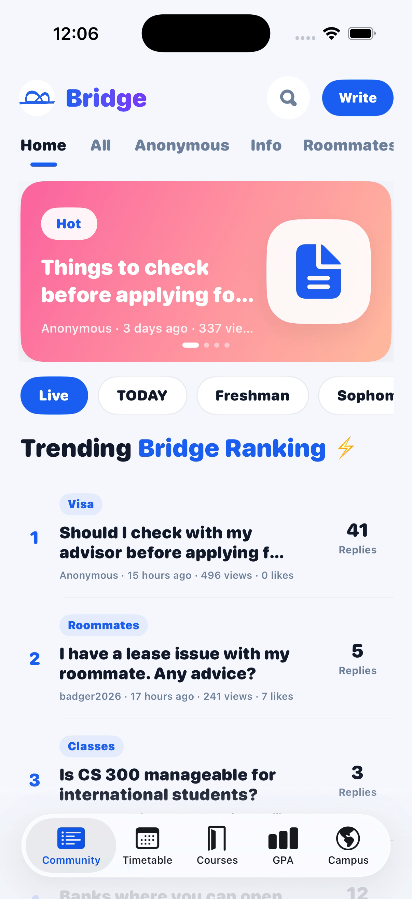
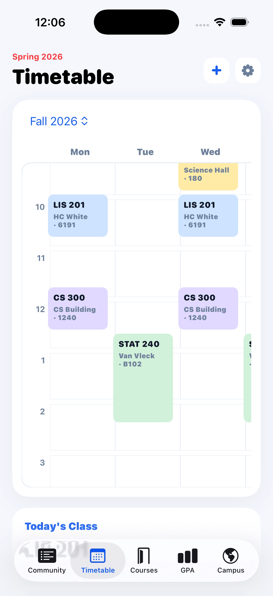

### 👩🏻‍💻 Introducing Myself

Hi, I'm **Raein Seo**, an Information Science student at the University of Wisconsin–Madison.  
I’m interested in **UX/UI design, frontend development, app development, and digital marketing.**

  

- Designing user-centered interfaces with 
- Building web projects using    
- Developing app ideas with  and 
- Creating branding and digital marketing content with 

### 📚 Projects

Welcome to my portfolio, where I showcase my [projects](YOUR_PORTFOLIO_LINK_HERE).

  
  
  

### 🌷 Connect

&nbsp;&nbsp;

