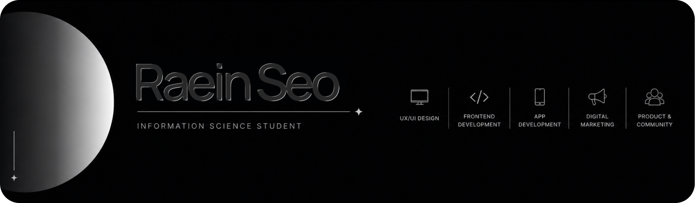

## 👩🏻‍💻 Introducing Myself

Hi, I'm **Raein Seo**, an Information Science student at the University of Wisconsin–Madison.  
I’m interested in **UX/UI design, frontend development, app development, and digital marketing**.

- Designing user-centered interfaces with 
- Building web projects using
  
  
  
  
- Developing app ideas with 
 and 
- Creating branding and digital marketing content with 
  
### 📚 Projects

Welcome to my portfolio, where I showcase my [projects](YOUR_PORTFOLIO_LINK_HERE).

## 🌷 Connect

[Portfolio](포트폴리오링크) · [LinkedIn](www.linkedin.com/in/raein-seo) · [Email](mailto:rein0ju06@gmail.com)
